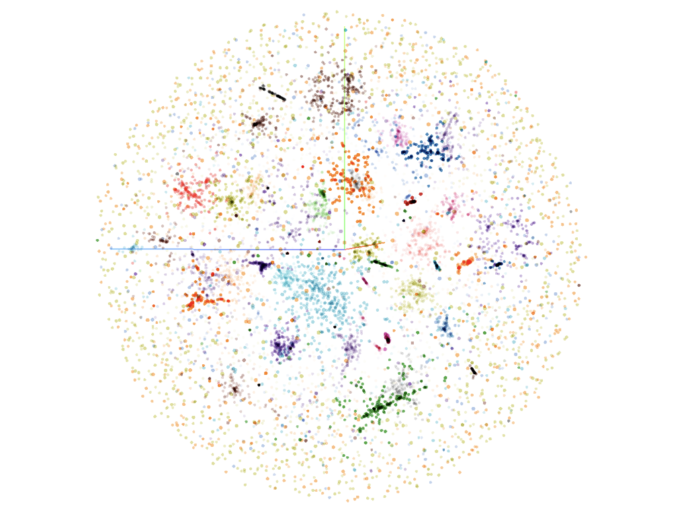

## Code layout
1. `corpus_creation.py`: Reads in PDFs/EPUBs/text files, processes them, and saves the cleaned tokens to a text file for whichever NLP model.
2. `training.py` Actually does the training. Also has functionality to assess and compare model accuracy.
3. `analysis.py` Very messy, mostly just my exploration sandbox. Has clustering at the bottom.
4. `visualization.py` Has a single function to port a gensim word vector instance into Tensorboard.
