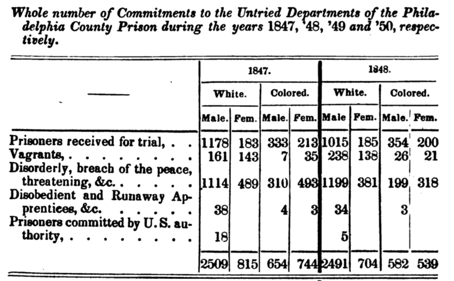

\thispagestyle{empty}

\clearpage

In the "Methods" chapter of the first volume of *The History of Sexuality*, Michel Foucault gives us exactly four rules---qualified as cautionary prescriptions---to follow when conducting an analysis of power.
Foucault first outlines an approach that analyzes "local centers" of power-knowledge (e.g. relations of confession, whether in the confessional box or the psychiatrist's office) and how they link up to the larger network of power relations. 
Subsequently, he introduces *the rule of tactical polyvalence of discourses*:  

> What is said about sex must not be analyzed simply as the surface of a projection of these power mechanisms.
> Indeed, it is in discourse that power and knowledge are joined together. 
> And for this very reason, we must conceive of discourse as a series of discontinuous segments whose tactical function is neither uniform nor stable. 
> To be more precise, we must [imagine] a world of discourse...as a multiplicity of discursive elements that can come into play in various strategies. 
> It is this distribution that we must reconstruct, with the things said and those concealed, the enunciations required and those forbidden, that it comprises. [@HoS 100]

\noindent
For Foucault, discourse is the privileged site of synthesis for power and knowledge.
Time and time again, he emphasizes the heterogeneity and incongruity of techniques of power that emerge from localized contexts. 
It is through discourse that disparate techniques are made to function together within a general strategy, and it is by way of discourse that a technique is installed in a new field of application.
For example, the implementation of the prison-form in the penal system was made acceptable in part by the discourse on penalty as debt, which formulates incarceration as the repayment of the offender's debt to society; "the 'truth' is precisely in these 'ideological' discourses".[@PS 71]
(As an aside, this development parallels the implementation of the wage-form within the economic system; in both cases, "the time of life" becomes an extractable and exchangeable quantity, although Foucault is careful not to assign a causal relationship between these two developments.)[@PS 83]

Just as material techniques of power can be inconsistent with or even counteract one another in a given situation, the various elements of discourse often contradict each other.
Even as incarceration was being justified as the settling of a debt by the extraction of time, there was another set of statements that framed imprisonment as a preventative measure designed to deter others from committing the same crime.
These two discourses on incarceration, one retributive and one preventative, seek to use the same means to achieve very different ends; and yet together they functioned to increase the acceptability of the prison despite their incongruity.
This is an example what Foucault means when he states that 
"[d]iscourses are tactical elements or blocks operating in the field of force relations; there can exist different and even contradictory discourses within the same strategy; they can on the contrary, circulate without changing their form from one strategy to another, opposing strategy."[@HoS 101--2]

Despite the privileged role discourse plays in the circulation of power, it is not the exclusive domain of the powerful or the 'oppressors.'
Discourse can be appropriated from a variety of positions in service of a variety of means; Foucault takes the example of the discourse on homosexuality in *The History of Sexuality*.
While the prohibition against homosexuality became more intense and explicit through its formalization in a medico-biological language of heredity and degeneration of the species, this same formalization created space for a counter-discourse to appear: if homosexuality is a medical condition it must be recognized as a legitimate phenomenon, and must be treated rather than punished.
Thus "[d]iscourse transmits and produces power; it reinforces it, but also undermines and exposes it, renders it fragile and makes it possible to thwart it."[@HoS 101]
In *Nietzsche, Genealogy, History*, Foucault calls his genealogical method a "technology of cutting"---there is a certain kind of discursive analytics that is directly linked to struggle and material objectives.

So, we can take a knife to power by reconstructing the distribution of enunciative acts that constitutes a discourse.
In this project I would like explore a different method for reconstructing a discursive distributions, one that takes advantage of the remarkable advancements made in the natural language processing community over the past five years. 
By compiling and reducing statistical information on the cooccurrence of words within a corpus, it is possible to embed words in a high-dimensional vector space.
Similarity between word vectors implies that the words often appear next to each other, or that they often appear in similar contexts.

While at first glance this may seem more akin to a Nietzschean, philological analysis, I think that it actually has more in common with Foucault's analysis of the rules governing discursive statements.
In *The Archaeology of the Sciences*, Foucault suggests that "it might be legitimate, on the basis of correctly described relations, to constitute discursive ensembles that would not be new but would, however, have remained invisible." 
These invisible ensembles could be brought to light through an analysis of statements: more specifically, an analysis "of their coexistence, of their succession, of their mutual dependence, of their reciprocal determination, of their independent or correlative transformation."[@AoS 309]
As discussed in the following section, this is almost exactly how word embedding algorithms extract information from a corpus.
For example, the Word2Vec algorithm learns how the 'context' words surrounding a given 'target' word dictate the appearance of the target word by counting how often words cooccur with each other.
Word2Vec learns these cooccurrence relations for all the words in a corpus---taken as, a whole I argue that these relations constitute "the set of conditions which, at a given moment and in a determinate society, govern the appearance of statements, their preservation, the links established between them."[@AoS 309]
In fact, Word2Vec can be used to 'score' a sentence, estimating how likely it is to appear within a corpus.

The information word embeddings extract from a corpus is not directly accessible or understandable by humans, but there are ways of interpreting the information learned by these algorithms. 
I will explore some of these interpretive techniques in the following pages; in Foucault's words, this work "should be read as an ensemble of descriptive experiments still in basic outline."[@AoS 310]

# Methods

The first step to training a word embedding model is building up a corpus.
All the documents used to create the corpus are feely available on Google Books; please refer to the Appendix for a list titles. 
Search terms like 'prison,', 'discipline,' and 'penal' were used to identify texts relevant to the penal apparatus.
Raw text was extracted from the downloaded files, which were all PDFs or EPUBs.
Google uses automated text-recognition software to extract the text from scanned images; the raw text contains a great deal of errors or 'noise,' in large part due to the idiosyncrasies and variations of 19th-century typesetting.
As such, preprocessing was required before the text could be fed to the word embedding model.
The software packages \texttt{spaCy} and \texttt{gensim} were used to accomplish this.
Text was first split into 'tokens:' words, punctuation, numbers, etc.
Tokens were lower-cased; numbers ('1,' 'one') were replaced with the token 'NUM', and proper nouns with 'PNOUN.'
This makes things easier for the word embedding model, as it does not have to learn different meanings for every numeric token.

Subsequently, a 'phraser' was used to merge tokens that appear next to each other with high frequency.
The assumption is that these phrases or 'bigrams' have a different significance than their components---for example, 'New York' has a very different meaning than either 'new' or 'York'.
The phraser was passed over the corpus twice.
In the first iteration, tokens were combined as long as the merged word was an acceptable English word.
This helps mitigate the occurrence of word-fragments produced erroneously produced by Google's text recognition software: for example, the tokens 'disci' and 'pline' are merged into 'discipline.'
The second round joins tokens with an underscore if i) they appear in succession frequently and ii) the individual tokens do not appear in too many other contexts.
Thus, 'poorer' 'classes' is merged into 'poorer_classes', but 'i' 'am' is left as-is.

After preprocessing, the corpus contains 34,224 unique words and 3,735,293 total words.
The Word2Vec algorithm [@mikolov13] was used to learn the word embeddings.
The algorithm was set to ignore words that appeared less than fifteen times across the whole corpus, leaving an effective training sample of 12,526 unique words and 3,672,319 total words.
Each word is represented by a vector made up of 300 values; as such, words are embedded in a 300-dimensional space.
Word2Vec works by dragging a 'window' across the corpus, building up statistics on how often words appear together in the window.
Here, the window size is set so that for a given target word, the algorithm is sensitive to the five words on either side of the target word. 
An example: sliding the window across the sentence "It may perhaps be surmised that I am about to insist that my favourite discipline is that which ought to be embraced by the whole kingdom"[^1]  would learn that 'I' and 'that' cooccur twice, but 'I' and 'my' do not cooccur at all.

Word2Vec drags the window over the corpus several times, learning the vectors for each word using a neural network.
Essentially, Word2Vec tries to answer the following question:
'Given the surrounding ten context words, what is the target word most likely to be?'
Asking this question millions of times ideally allows the word vectors to converge to a solution that captures as much information as possible from the corpus.
In reality, the algorithm actually outputs two vectors for each word.
If the first-order word vectors for two different words are similar, it means the words appear next to each other frequently; if their second-order context vectors are similar, it means the words appear in the same *context* as each other frequently.
These two vectors are summed to create a single vector representation of each word.

[^1]: Taken from the beginning of *Revelations of Prison Life*, 1856.

# Results & Analysis

The basic metric for comparing words measures the angle between their vectors, and is known as 'cosine similarity.'
Thus, word-vectors with high cosine similarity will point in the same direction, while word-vectors with a very low cosine similarity will point in opposite directions.
The simplest way to analyze word vectors is to look at their cosine similarity; Table 1 shows some examples.
The first thing to notice is that model works; not only has the model captured common-sense semantic relatedness ('punishment' is similar to 'penalty'), but  it has handles variations between British and American English ('colored' vs. 'coloured').
It has also learned some relations that aren't 'real'---the word fragment 'pline' produced by errors in the Google text recognition software often shows up in similar contexts as 'discipline,' so the model thinks that the two are related.
Things become more interesting as we move onto relations not predicted by common sense.
We are now moving into the realm of interpretation, and I would like to qualify the following analysis by observing that not only are relations open to a wide variety of interpretations, but there really isn't any way to know whether an unexpected relation is 'real' or just a quirk of the model.
There are ways to estimate the noise inherent in the model, but they are beyond the scope of this work. 

I was particularly excited to see 'architecture' in such close proximity to 'discipline' given Foucault's emphasis on the architectural aspects of disciplinary power in the "Panopticism" chapter of *Discipline and Punish*.
Discipline's inversion of the amphitheater and the spectacle into the panoptic model and surveillance is one of its most important characteristics.
The Panopticon is "the diagram of a mechanism of power reduced to its ideal form; its functioning...must be represented as a pure architectural and optical system."[@DP 205]
Furthermore, the proximity of 'system' and 'workings' to 'discipline' evokes the Foucault's description of discipline as machinery, while 'treatment' and 'regulations' might hint at discipline's normalizing function.
'Classification,' which shares several words with 'discipline,' is clearly associated with spatial segmentation.
This is not surprising in light of Foucault's assertion "that the disciplines use procedures of partitioning and verticality, that they introduce, between the different elements at the same level, as solid separations as possible."[@DP 220]
The final two columns have to do with a topic that Foucault rarely addressed: American racism.
The proximity of 'colored' with the numerical placeholder 'NUM' is likely an effect of the longstanding American practice, stretching back to the first itemized slave ship logs, of reducing Black life to figures in a table.
Figure 1 gives an example of such a table.

\singlespacing

+--------------+----------------+-----------------------+-----------+----------+
| punishment   | discipline     | classification        | colored   | negro    |
+==============+================+=======================+===========+==========+
| penalty      | pline          | treatment             | white     | mulatto  |
+--------------+----------------+-----------------------+-----------+----------+
| punishments  | system         | separate confinement  | coloured  | robber   |
+--------------+----------------+-----------------------+-----------+----------+
| penalties    | treatment      | religious instruction | male      | german   |
+--------------+----------------+-----------------------+-----------+----------+
| imprisonment | architecture   | separation            | NUM       | burglar  |
+--------------+----------------+-----------------------+-----------+----------+
| sentence     | management     | relaxation            | mulatto   | murderer |
+--------------+----------------+-----------------------+-----------+----------+
| infliction   | workings       | dietary               | young     | slave    |
+--------------+----------------+-----------------------+-----------+----------+
| chastisement | administration | supervision           | black     | colored  |
+--------------+----------------+-----------------------+-----------+----------+
| torture      | systems        | cellular              | bobbin    | african  |
+--------------+----------------+-----------------------+-----------+----------+
| vengeance    | regulations    | regulation            | female    | poet     |
+--------------+----------------+-----------------------+-----------+----------+
| treatment    | literature     | correction            | blacks    | youngman |
+--------------+----------------+-----------------------+-----------+----------+

Table: The most similar words to 'punishment,' 'classification,' 'discipline,' 'colored,' and 'negro,' in descending order.  

\doublespacing

Furthermore, 'negro' seems to have a more negative connotation than 'colored;' to investigate this further, I will now introduce the second common way of analyzing word vectors: word analogies.
Word analogies are not a foreign concept, of course.
Take the analogy "woman is to man as girl is to boy:" the operation or transformation that maps 'woman' to 'man' also maps 'girl' to 'boy' (incidentally, this analogy is correctly predicted by the model).
This analogy is mathematically equivalent to $man - woman + girl = boy$; that is, 'boy' is the sum of the vector from 'woman' to 'man' (i.e. $man - woman$) and the vector for 'girl.'
This exactly how analogies are calculated with the Word2Vec model; the vectors are combined as above, and then cosine similarity is used to find the nearest words to the new vector.

{width=75%}

It should be noted that word analogies can be very misleading.[^2]
To see why, consider an arbitrary analogy "*A* is to *B* as *C* is to *D*," where $D$ is unknown: $B-A + C = D$.
It may be the case that subtracting *A* from *B* does not significantly change the vector for *B*: that is, $B-A \approx B$.
If so, then $D \approx B + C$ and the word vectors most similar to $D$ will be some combination of the word vectors most similar to $B$ and $C$.
On several occasions this fooled me into thinking I had found some significant relation between words, when in reality the analogy wasn't returning anything that wasn't there to begin with.
In light of this, it seems to me that what we are really interested in are the words closest to $D$ that aren't so close to $B$ or $C$.
To quantify this, we can compare a word's proximity to $D$ and its proximity to $B+C$.
Cosine similarity does not make for a good metric in this case; instead, I chose to use number-of-words-away, which I will call 'word distance.'
Higher word-distances imply a larger shift in meaning carried in the mapping.
For example, if a word is only the 1000th-most similar word to $B+C$ but is the most similar to $D$, it is likely that we are seeing something significant.

[^2]: Forgive me for the technicality and lack of clarity in this paragraph; I couldn't think of a way explaining myself in a concise and non-mathematical way.

\singlespacing

+------------------------+--------------------+-------------------------+------------------------------+
| colored $\to$ negro \  | sin $\to$ sinner \ | sin $\to$ confession \  | sin $\to$ repentance \       |
|  poor $\to$ ?          |  crime $\to$ ?     |  crime $\to$ ?          |  delinquency $\to$ ?         |
+=======================:+===================:+========================:+=============================:+
| felon (63)             | robber (1)         | conviction (10)         | educational (1152)           |
+------------------------+--------------------+-------------------------+------------------------------+
| drunkard (247)         | knave (-1)         | trial (11)              | reformation (-1)             |
+------------------------+--------------------+-------------------------+------------------------------+
| flag (205)             | madman (12)        | payment (200)           | handbook (2851)              |
+------------------------+--------------------+-------------------------+------------------------------+
| man (16)               | pet (531)          | chadwick (669)          | industrial training (41)     |
+------------------------+--------------------+-------------------------+------------------------------+
| wharves (40)           | felon (4)          | assault (35)            | penitence (5)                |
+------------------------+--------------------+-------------------------+------------------------------+

Table: Selected word analogies. The number in parentheses is the relative "word distance" (explained above).

\doublespacing

With word embedding analogies introduced, we can return to the question at hand: does 'negro' has a more negative connotation than 'colored?' 
To explore this, we can map the vector from 'colored' to 'negro' onto a new word.
I chose 'poor,' since like 'colored' it refers to a position at the bottom of the social hierarchy without carrying an explicit moral connotation.
The results can be found in the first column of Table 2; the number in parentheses following each word is the word distance as defined in the preceding paragraph.
It seems that $negro - colored$ maps 'poor' to a decidedly negative region of vector space, one that is distinct from the the locations of 'negro' and 'poor.'
I have included three more word analogies in Table 2, all exploring the relationship between notions of religious and legal transgression.
This is motivated in part by Foucault's discussion of the "Christianization" of the penal system that accompanied the introduction of the penitentiary.
Foucault points out the heterogeneity between two discourses here: 
"How can we speak of penance at a time when the theory of society, the practico-theoretical ensemble of penality, implies that there can be crime only if society is injured, punishment only inasmuch as society has to defend itself, and where there cannot be any fundamental relationship between sin and crime, penalty and penance?"[@PS 89]
I am not yet ready to answer the genealogical 'how?' posed here, but the word analogies provide archaeological evidence that penance was indeed spoken of in relation to punishment.
The mapping from 'sin' as abstract concept to 'sinner' as one-who-sins also maps crime to one-who-commits-crime, but this may be more of a grammatical/part-of-speech relationship than a semantic one---especially considering the low relative word distances.
More convincingly, the trial and conviction seem to be the juridical analog of the confessional; furthermore, 'payment' recalls the conception of penalty as debt discussed at the beginning of this work.
The final word analogy might be interpreted as evidence of a linkage between repentance as absolution of sin in the eyes of God and education as the washing away of delinquency in the eyes of society.
The inclusion of 'industrial training' highlights education as transforming the delinquent into a productive member of society.

The final analytic tool I will mention here is clustering; it has proved to be one of the most useful methods, especially for mapping out the complex distributions of words.
Clustering is a 'shallow' machine learning technique; as the name suggests, clustering algorithms assign words to clusters such that a word has more in common with the other members of its cluster than it does with the members of any other cluster.
One of the advantages of clustering is that it can be used without imposing any theoretical constraints upon the analysis.
While the word analogies discussed above require some a priori knowledge of the relationships between words, and probably allows this researcher to see what he wants to see, clustering allows a more hands-off and empirical result.
Furthermore, clusters do not seem to be overly dictated by syntax; while cosine distance tends to return words that play a similar syntactical or grammatical role (-ly adjectives, plural nouns, etc), clusters capture a wider variety of relations.
Some are specific to the consumption of goods ('fruit', 'diet', 'tobacco', 'tongue'), while others are oriented towards 'the gentle way in punishment' ('punishment', 'education', 'benefit', 'assistance', 'reform', 'surveillance').

Thousands of words can constitute a single cluster, so conveying the meaning captured by a cluster is difficult.
However, clusters can be visualized with Tensorflow, Google's machine learning software.[^3]
Tensorflow's embedding projector compresses the 300-dimensional word vectors down to three dimensions, and allows interactive exploration of the resulting space.
The image on the title page of this paper shows the distribution of all 12,526 of the word vectors learned by the model; each point represents a single word.
The words are color-coded by cluster, and are distributed so that nearby words have have similar vectors.
Figure 2 shows in detail a single cluster within the larger distribution.
The cluster, containing words like 'crime,' 'disease,' 'sin,' and 'pauperism,' seems to encapsulate a polemical rhetoric directed at the lower classes.

[^3]: Projected word embeddings can be viewed at https://projector.tensorflow.org. No technical experience is needed to use the visualizer. While Google's embeddings are of course not trained on prison discourse, I cannot recommend exploring the projector enough. It gives an intuitive sense of the meaning captured by word embeddings, and is worth a thousand figures.

# Conclusions

Numerous avenues opened up by the method I have outlined remain unexplored, and I would like to take a moment to gesture towards possibilities for future work.
First and foremost, I hope to place Foucault's methodology in relation to the techniques described above with much more care and thoroughness than I was able to do here.
For example, *On the Archaeology of the Sciences* impressed upon me both the difficulty and the necessity of delineating a discursive formation in a way that does not impose a taken-for-granted theoretical segmentation.
Of course Foucault readily admits that to one must start somewhere:
"As a first approximation, a provisional parceling must be accepted; an initial region, which analysis will overturn and reorganize once it has been able to define an ensemble of relations."[@AoS 310]
Natural language processing may once again be of use here: researchers have had a great deal of success generalizing the Word2Vec model to paragraphs and even documents, allowing the similarities between different documents to be assessed.
In light of this, I think there is a great deal of potential to use document similarity metrics to help disclose the network of relations linking up ostensibly unrelated discourses.
Could one could conduct an analysis of a field of discursive events by starting from a "provisional parceling" and then mapping out a relational graph between discursive elements?

Another exciting aspect of a word-embedding analytic of discursive is its temporal applicability.
At the beginning of *Discipline and Punish*, Foucault has the following to say about his historical project:

> I would like to write the history of the prison, with all the political investments of the body that it gathers together in its closed architecture.
> Why? Simply Because I am interested in the past?
> No, if one means by that writing a history of the past in terms of the present. 
> Yes, if one means writing the history of the present. [@DP, 230--1]
 
Foucault set out to write a history of the prison not because of abstract academic curiosity or merely to compare our current penal system to previous models.
He understood that a careful genealogy of the power to punish could open up points of attack and struggle *in the present*.
Thus, Foucault is interested in the genealogy of various discourses or *dispositifs* because they relate to what is to be done in the present.
The technique I propose here can be applied to secular modifications in the functioning of power, but it can also used to analyze 'real-time' fluctations within discourse.
For example, consider a statistical analysis of 'alt-right' message boards, or of discourse on drone warfare in the Obama and Trump administrations.

In this paper, I have proposed a new technique for analyzing discourse.
I began by outlining the importance of discourse in Foucault's theoretical framework, and its relation to material realities.
I then tried to highlight Foucault's conception of discursive formations as complex distributional spaces made up of heterogeneous elements that can have multiple (contradictory) functions at the same time.
Machine learning learning algorithms can embed words in high-dimensional vector spaces based on their cooccurrence; I argue that the distributions produced by theses algorithms are extremely compatible with Foucault's description of discourse, and could provide an powerful supplement to more traditional forms of research.
To illustrate the potential of this technique, I trained a Word2Vec model on a sample of 19th-century prison discourse, and showed some of the ways the resulting vector space can be analyzed.
I make no claims as to the the significance or accuracy of my findings; I intend this work to be a proof-of-concept to show that such an analysis can be done.
With this goal accomplished, I will end here.

<!-- The aspects of Foucault's work covered in class this semester offer an especially rich diagram of the unfolding of the discourse on punishment and incarceration.
In this project, I have been trying to use Foucault's genealogy of our punitive society both as a roadmap to guide me as I explore this complex space and as a point of comparison for my findings.
I find myself in the strange position of having an intuitive understanding of Foucault's research methodology during the later period covered in class, but am not familiar with the apparently different Foucault who laid out his  practice of research in *The Archaeology of Knowledge*.
However, there is unfortunately little overlap between the assigned readings from Foucault's genealogical period and the author's archaeological theory of discursive formations and positivity.
Aside from the occasional digression in one lecture course or another, the Foucault we covered in class is for the most part concerned with presenting findings and relating his work to practice and struggle rather than discussing the mechanics of his archaeological method.
As such, I will draw heavily on *On the Archaeology of the Sciences*, and possibly excerpts from *The Archaeology of Knowledge* as Well.
Because of my lack of previous experience with the concepts presented in these works, I am sure I will misinterpret some of the points Foucault makes, or anachronistically superimpose his later concepts onto his earlier work.

One of the most glaring points of confusion for me is the distinction between genealogy and archaeology, as well as its importance.
As such, I would like to take a moment to explain the relationship I understand to exist between the two technologies.
In the *Stanford Encyclopedia of Philosophy*, Gary Gutting writes that Foucault's archaeological method is predicated upon an analysis of systems of knowing and thinking as being governed by a set of nonsubjective rules.
These rules dictate the kinds of statements that count as appropriate, coherent, or truthful, and like all Foucauldian concepts, neither originate from a single source nor 
~~are enforced by a given institution~~.
Instead, they are constantly reproduced and modified through a series of events, conflicts, etc.
Archaeology analyzes and juxtaposes discourses in order to extract the rules that govern them, and to point out the apparent contingencies of their existence.
For example, in *The Punitive Society*: "Until now, we have been studying the threads of possible derivations; for example, how ideas and institutions join up with each other within the theoretical and practical penal system." 
In contrast, genealogy tries to trace the transition from one discourse to another, how it happened and which contingencies were involved:
"Now it is a matter of finding the power relationships that make the historical emergence of something like the prison possible. After an archaeological type of analysis, it is a matter of undertaking a dynastic, genealogical type of analysis, focusing on filiations on the basis of power relations"[@PS 83--84]

If, for Foucault, "[t]o analyze a discursive formation... is to deal with a group of verbal performances at the level of the statements and of the form of positivity that characterizes them"[@AoK 125], I am interested in an analysis that is simultaneously more specific and more general.
Could one carry out an analysis of a discursive formation by dealing with the articulation of *words* within discourse, by dealing with their correlations and distributions with respect to each other?
Foucault is clear that the object of his study is "groups of statements." 
Could a knowledge of these groups be created directly from the words that constitute each statement?
This kind of statistical approach to discourse is a very different kind of technology than the one employed by Foucault; it may engender or require a different rationality.
As such, I think it will be important to clarify Foucault's position on the importance or significance of discourse, and on how it can be effectively analyzed.
I may have to part with Foucault at certain points---for example, is the positivity of statements washed out in this kind of statistical approach?

It feels as though I have been wandering around the discursive closets of these men who call themselves philanthropists. -->

<!-- \clearpage 

   
 -->
 
\clearpage 
 
# Appendix

The corpus used in this work was constructed from the following documents (some titles abbreviated). 
All documents are freely available on Google Books.

\singlespacing \noindent
1826-1835: *Reports of the Prison Discipline Society*  
1850: *The Journal of Prison Discipline and Philanthropy*  
1851: *The Pennsylvania Journal of Prison Discipline*  
1852: *Report on the Discipline and Management*  
1852: *The Pennsylvania Journal of Prison Discipline*  
1852: *Annual Report of the Board of Managers of the Prison Discipline Society*  
1854: *Remarks on the Principles of Criminal Legislation*  
1854: *Pennsylvania Journal of Prison Discipline*  
1855: *Remarks on the Penal System of Pennsylvania*  
1855: *The Philanthropist and Prison and Reform*  
1856: *Revelations of Prison Life*  
1856: *The Journal of Prison Discipline and Philanthropy*  
1857: *The Penal Code of the State of Texas*  
1858: *The Journal of Prison Discipline and Philanthropy*  
1859: *Annual Report of the Officers of the Indiana*  
1859: *The Journal of Prison Discipline and Philanthropy*  
1860: *The Journal of Prison Discipline and Philanthropy*  
1860: *The Penal Laws of Pennsylvania*  
1860: *Remarks on Cellular Separation*  
1862: *The Journal of Prison Discipline and Philanthropy*  
1863: *Reports and Observations on the Discipline and Management of Convict Prisons*  
1866: *The Journal of Prison Discipline and Philanthropy*  
1867: *Pennsylvania System of Separate Confinement*  
1867: *Remarks on Cellular Separation*  
1868: *The Journal of Prison Discipline and Philanthropy*  
1877: *Chapters on Social Sciences as Connected with the Administration of State Charities*  

\clearpage
\doublespacing
 
 
# References

